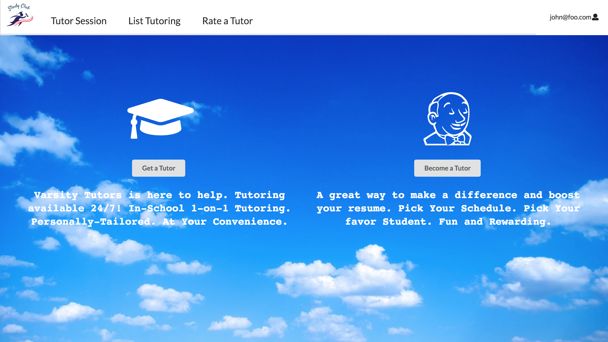

ICS students often spend more time than they need on their homework and don’t learn the material as effectively as they could, because they study alone and do not leverage the power of face-to-face study groups with peer mentors.

  

Our application offers the opportunity for students to work on their homework with peers. When people enter our website, they can choose to be a tutor or tutee. Besides, we offer differnt learning style that students can choose. For example, we have one to one, online, and group session. Students can work with people that have differnt cultural backgrounds. 

For this team project, I am responsible for the landing page and user profile page. I spent a lot of time to design our landing page, which could make it look well-organize and clean. And then, I created the user profile page for users to update their profile information. I also design the outlook of our application. 

View us: [Study Club](http://studyclub2.meteorapp.com/#/) online

View us: [Study Club](https://studyclub2018.github.io/) on Github

