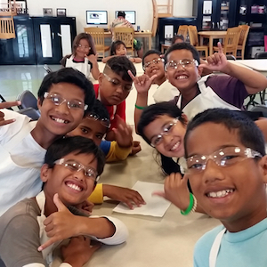

  

Community service is a common service for people to take care of each other and volunteer. To get started with my service learning, I participated in the Palolo Pipeline program. My service learning took place in the Palolo Service Learning Center. When I first started my service learning, I didn’t know what to expect. I felt nervous and anxious, because I felt that if it went bad, I wouldn’t be able to stay in the program anymore. But it ended up being the exact opposite. I found my service learning very beneficial. My duties were to watch the kids who participated in this program, play with them and help them with their homework. I really enjoyed interacting with the different kinds of kids and learn their culture. I think this would be a great opportunity for me to get involved with an institution that functions to serve and support our community. Social ties hold people together and are able to support and take care of the young kidsI was happy I was able to help them facilitate the events and activities that provide hope and comfort to many families and children in the area.

You can learn more at the website: https://servicelearning.chaminade.edu/find-a-project/palolo-ohana-learning-center/.

