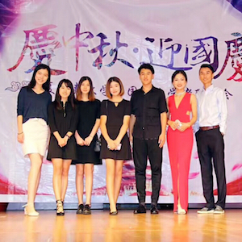

In my college life, I have participated in some events and activities. One of the event that I participated was Traditional Chinese Mid-Autumn Festival. It was lauched in the UH music center. That was an excellent experience. In this event, I was part of the organization that help to set up the activities and shows. For example, we invited many Chinese organizations to work with us. The shows included singing, dancing, martial arts performance etc. Most of the audiences were Chineses people, they were from different regions in China. We celebrate the festival together. Everyone was helping to arrange the schedule and set up the stage. It was such a fun and interesting experience! 

More info about the event: https://www.hawaii.edu/calendar/manoa/2016/09/14/29466.html?et_id=38721
